# ERD REVISED (CORRECTED)

Dokumen ini merepresentasikan Entity Relationship Diagram (ERD) dari seluruh entitas database, menunjukkan PK, FK, nullability, relasi kardinalitas, scope organisasi, dan unique constraints.

```mermaid
erDiagram

%% 1. ORGANIZATION & AUTH BOUNDARY
Organization {
    bigint id PK
    string code UK "UK: code"
    string name
    boolean is_active
}

User {
    bigint id PK
    bigint organization_id FK "UK: org_id + email"
    string name
    string email
    string password_hash
    boolean is_active
}

%% Spatie Laravel Permission Standard Schema (Roles & Permissions)
Role {
    bigint id PK
    bigint organization_id FK "UK: org_id + name"
    string name
    string guard_name
}

Permission {
    bigint id PK
    string name
    string guard_name
}

ModelHasRoles {
    bigint role_id FK
    string model_type
    bigint model_id
}

%% 2. ACCOUNTING DOMAIN
FiscalPeriod {
    bigint id PK
    bigint organization_id FK "UK: org_id + year + month"
    int year
    int month
    string status "OPEN, SOFT_CLOSE, CLOSED"
    timestamp opened_at
    timestamp closed_at
    bigint closed_by FK "Nullable"
}

Account {
    bigint id PK
    bigint organization_id FK "UK: org_id + code"
    bigint parent_id FK "Nullable"
    string code
    string name
    string account_type "ASSET, LIABILITY, EQUITY, REVENUE, EXPENSE"
    string normal_balance "DEBIT, CREDIT"
    boolean is_postable
    boolean is_active
    string legacy_code "Nullable"
}

AccountMapping {
    bigint id PK
    bigint organization_id FK "UK: org_id + legacy_code"
    string legacy_code
    bigint canonical_account_id FK
    date effective_date
}

%% 3. COUNTERPARTY
Counterparty {
    bigint id PK
    bigint organization_id FK
    string name
    string type "INTERNAL, EXTERNAL, BANK"
    boolean is_active
}

CounterpartyAlias {
    bigint id PK
    bigint counterparty_id FK
    string normalized_alias "UK: counterparty_id + alias"
}

%% 4. BANK & INGESTION
BankAccount {
    bigint id PK
    bigint organization_id FK
    string bank_name
    string account_no_masked
    bigint coa_account_id FK
    boolean is_active
}

OpeningBalanceSource {
    bigint id PK
    bigint organization_id FK
    bigint bank_account_id FK "Nullable"
    date source_date
    string source_type "NERACA_AWAL, BANK_STATEMENT"
    string source_reference "Nullable"
    decimal amount
    string currency
    string description
    string status "DRAFT, PROCESSED"
}

BankImport {
    bigint id PK
    bigint organization_id FK
    bigint bank_account_id FK
    string file_name
    string file_hash "UK: org_id + bank_id + file_hash"
    string status
}

BankTransaction {
    bigint id PK
    bigint organization_id FK
    bigint bank_import_id FK
    bigint bank_account_id FK
    string fingerprint "UK: org_id + fingerprint"
    date transaction_date
    string description
    string counterparty_raw "Nullable"
    string legacy_code "Nullable"
    decimal debit_amount
    decimal credit_amount
    decimal amount
    string direction "IN, OUT, TRANSFER"
    decimal balance
    string source_file
    string source_sheet
    int source_row
    jsonb raw_data
    string classification_status
}

%% 5. BUSINESS TRANSACTION
BusinessTransaction {
    bigint id PK
    bigint organization_id FK
    string transaction_number "UK: org_id + transaction_number"
    date transaction_date
    string transaction_type
    string direction
    decimal amount
    bigint counterparty_id FK "Nullable"
    bigint bank_transaction_id FK "Nullable"
    string classification_status
    string classification_method "Nullable"
    decimal classification_confidence "Nullable"
    string description
    string status
    bigint fiscal_period_id FK
}

%% 6. JOURNAL
JournalEntry {
    bigint id PK
    bigint organization_id FK
    bigint fiscal_period_id FK
    bigint business_transaction_id FK "Nullable"
    bigint opening_balance_source_id FK "Nullable"
    string journal_no "UK: org_id + journal_no"
    date date
    string memo "Nullable"
    string status "DRAFT, APPROVED, POSTED, REVERSED"
    string source_type "Nullable"
    bigint source_id "Nullable"
    bigint reversal_of_id FK "Nullable"
}

JournalLine {
    bigint id PK
    bigint journal_entry_id FK
    bigint account_id FK
    decimal debit
    decimal credit
    bigint counterparty_id FK "Nullable"
    bigint fund_id FK "Nullable"
    bigint receivable_id FK "Nullable"
    bigint bank_account_id FK "Nullable"
    bigint program_id FK "Nullable"
    bigint cost_center_id FK "Nullable"
}

%% 7. RECEIVABLE
Receivable {
    bigint id PK
    bigint organization_id FK
    string receivable_number "UK: org_id + receivable_number"
    bigint counterparty_id FK
    bigint account_id FK
    date issue_date
    date due_date "Nullable"
    decimal original_amount
    decimal outstanding_amount
    string status "ISSUED, PARTIALLY_PAID, PAID, OVERDUE, CANCELLED"
}

ReceivableAllocation {
    bigint id PK
    bigint organization_id FK
    bigint receivable_id FK
    bigint business_transaction_id FK "Nullable"
    bigint journal_entry_id FK "Nullable"
    decimal allocated_amount
    timestamp allocated_at
}

%% 8. FUND
Fund {
    bigint id PK
    bigint organization_id FK
    string code "UK: org_id + code"
    string name
    bigint account_id FK "Nullable, policy-neutral"
    string status
}

FundAllocation {
    bigint id PK
    bigint organization_id FK
    bigint fund_id FK
    decimal amount
    date date
    string purpose "Nullable"
}

FundCommitment {
    bigint id PK
    bigint organization_id FK
    bigint fund_id FK
    decimal amount
    date date
    string purpose "Nullable"
}

FundRealization {
    bigint id PK
    bigint organization_id FK
    bigint fund_allocation_id FK "Nullable"
    bigint fund_commitment_id FK "Nullable"
    bigint business_transaction_id FK "Nullable"
    decimal amount
    date date
}

FundReturn {
    bigint id PK
    bigint organization_id FK
    bigint fund_realization_id FK
    decimal amount
    date date
}

%% 9. RECONCILIATION
Reconciliation {
    bigint id PK
    bigint organization_id FK
    bigint bank_account_id FK
    bigint fiscal_period_id FK "UK: org_id + bank_id + period_id"
    decimal statement_opening_balance
    decimal statement_ending_balance
    decimal ledger_opening_balance
    decimal ledger_ending_balance
    decimal difference
    string status "OPEN, IN_PROGRESS, RECONCILED, CLOSED"
}

ReconciliationItem {
    bigint id PK
    bigint organization_id FK
    bigint reconciliation_id FK
    bigint bank_transaction_id FK "Nullable"
    bigint journal_entry_id FK "Nullable"
    string match_status "MATCHED, UNMATCHED_BANK, UNMATCHED_LEDGER, MANUAL_MATCH, EXCEPTION"
    string match_method "Nullable"
    string evidence "Nullable"
    bigint matched_by FK "Nullable"
}

%% 10. AUDIT & UTILITIES
AuditLog {
    bigint id PK
    bigint organization_id FK
    bigint user_id FK "Nullable"
    timestamp created_at
    string entity_table
    string entity_id
    string action
    jsonb before_json "Nullable"
    jsonb after_json "Nullable"
    string reason "Nullable"
    string ip_address "Nullable"
    string correlation_id "Nullable"
}

Attachment {
    bigint id PK
    bigint organization_id FK
    string entity_type
    bigint entity_id
    string file_path
    string file_name
    timestamp uploaded_at
}

%% RELATIONSHIPS
Organization ||--o{ User : "has"
Organization ||--o{ FiscalPeriod : "has"
Organization ||--o{ Account : "has"
Organization ||--o{ JournalEntry : "has"
Organization ||--o{ BankAccount : "has"
Organization ||--o{ Role : "has"

Role ||--o{ ModelHasRoles : "assigned to"
User ||--o{ ModelHasRoles : "has"

BankAccount ||--o{ OpeningBalanceSource : "init from"
OpeningBalanceSource ||--o| JournalEntry : "generates"

BankAccount ||--o{ BankImport : "receives"
BankImport ||--o{ BankTransaction : "contains"
BankAccount ||--o{ BankTransaction : "has"

BankTransaction ||--o| BusinessTransaction : "bridges to"
BusinessTransaction ||--o{ JournalEntry : "generates"

JournalEntry ||--|{ JournalLine : "has lines"
Account ||--o{ JournalLine : "used in"

Counterparty ||--o{ Receivable : "owes"
Receivable ||--o{ ReceivableAllocation : "paid via"
BusinessTransaction ||--o{ ReceivableAllocation : "funds"

Fund ||--o{ FundAllocation : "receives"
Fund ||--o{ FundCommitment : "has"
Fund ||--o{ FundRealization : "spends"
FundRealization ||--o{ FundReturn : "returns"

BankAccount ||--o{ Reconciliation : "reconciles"
Reconciliation ||--|{ ReconciliationItem : "contains"
BankTransaction ||--o{ ReconciliationItem : "matched in"
```

